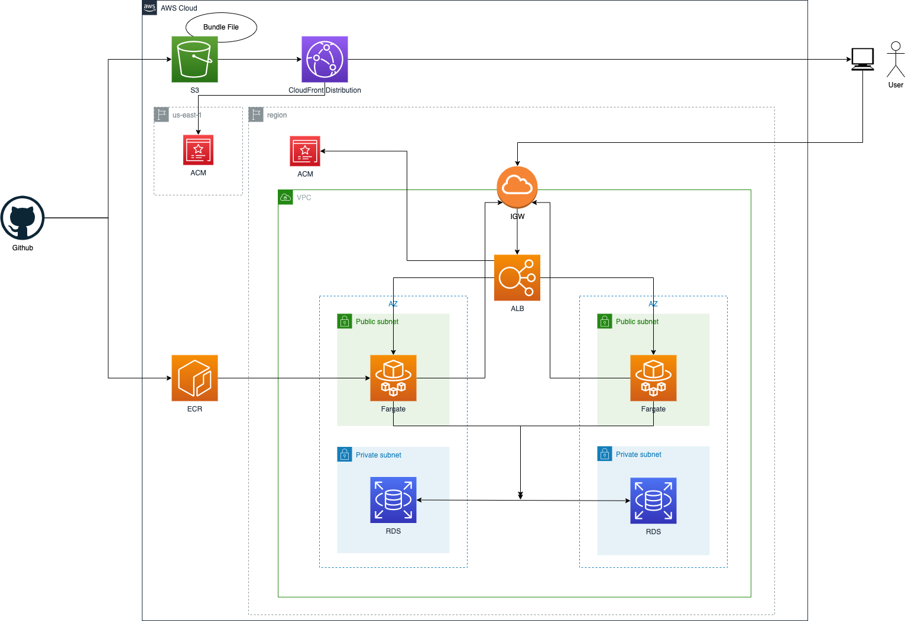

# Bookshelf

読書管理 WEB アプリの monorepo

## Common

- node.js v16.13.1
- yarn v1.22.17
  - May not launch with 2.x because not have `prepare` in lifecycle.

### Recommend

- nvm

### Setup Memo

- If you use a GUI tool to manage the git (as SourceTree), you must setup `~/.huskyrc` that defines a path to node.js (or node admin tools) to execute the commands through husky.

## Client

- React v17.0.2
- Webpack
- Babel
- Java Runtime (for openapi-generator)

### Getting started

```shell
# in local
$ yarn cl openapi-generator:local
$ yarn cl dev
```

## Server

- Nest.js v8.0.0
- TypeORM
- Sqlite (may use MysQL in the future...)

### Setup

- You must setup `/packages/server/.env`
  - ```
    RAKUTEN_APP_ID=<Your API ID>
    ```

### Getting started

```shell
# in local
$ yarn sr migration:run
$ yarn sr start:dev
```

### Command

#### Migration

```shell
$ yarn sr migration:generate -n <Name of the migration file>
$ yarn sr migration:run
```

### Document

I use swagger for managing specifications of api.

Also the swagger is synchronized with source code using `@nestjs/swagger`

If you generate the swagger, execute command below.

```shell
$ yarn sr swagger:generate
```

And in this project, a command below is executed before run "git commit" using `husky` to prevent differences between the swagger and source code.
If there are differences, it is failed.

```shell
$ yarn sr swagger:check
```

## Infra

- AWS
- Terraform
- Terraform Cloud

### Diagram


